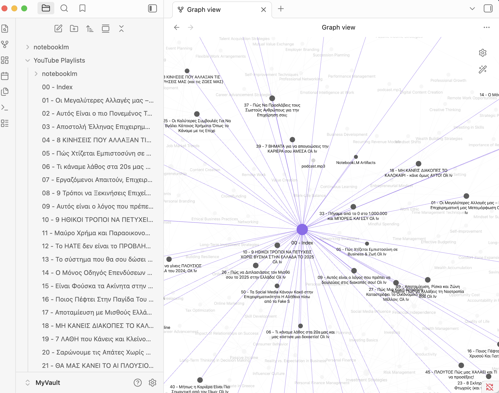
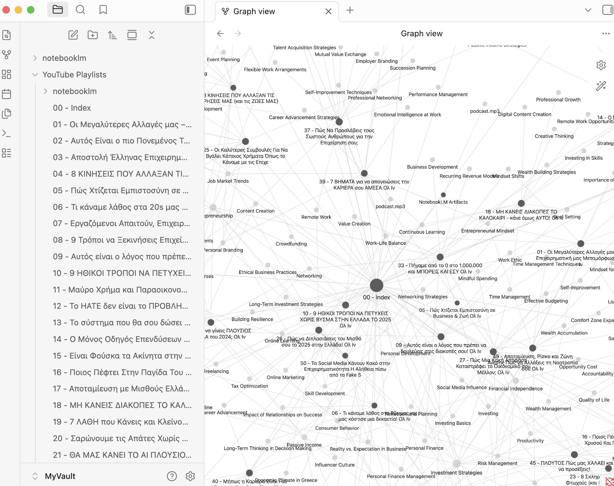

# YouTube → AI → NotebookLM → Obsidian 📺✨

Turn any YouTube playlist into **searchable, linked notes** with summaries, key ideas, and NotebookLM artifacts – ready for Obsidian or any Markdown editor.

This project started from a real use case: a 51‑video Greek business podcast playlist. As a Greek investor and long‑time follower of local finance creators, this repo is also a small “thank you” to **Chris Tsounis** and the wider Greek financial community for sharing so much practical knowledge.

You can reuse the same pipeline for **any playlist** – but to make it concrete, here’s the real example it was built on.

---

## Example: 51‑video Greek business playlist 💼🇬🇷

- **Playlist**: Ολ Ιν (business / career podcast) – part of the Greek finance / business creator ecosystem  
- **Videos**: 51 (50 with usable subtitles)  
- **Approx. cost**: ~**$0.13** for enrichment with `gpt-4o-mini`  
- **Output**:
  - 50 enriched JSON files in `data/enriched/`
  - 50 Markdown notes + index in your vault
  - NotebookLM notebook with all 50 sources
  - `podcast.mp3`, `mindmap.json`, `quiz.json`, `flashcards.json` downloaded and linked from Obsidian

### Obsidian navigation demo (GIF) 🧭

Short walkthrough of the example playlist vault – opening the index, jumping into individual episode notes, and exploring the graph:


### Graph views

- **High‑level graph (all notes + artifacts)** 🌐  
  

- **Zoomed‑in example graph** 🔍  
  

Your own vault and notes stay local; these visuals come from the documented example playlist.

### Inspired by Greek financial creators

[](https://www.youtube.com/watch?v=383CnQdrGsM&list=PLAQ71P0f2W3nJq8WD_Y9kRHZrHwg5c9tB)

Special thanks to **Chris Tsounis** and the wider Greek finance / business community for sharing so much practical knowledge — this repo is one way to turn that content into a living knowledge graph. 💚

---

## Features 🚀

- **End‑to‑end automation**
  - `YouTube playlist → transcripts → LLM enrichment → NotebookLM artifacts → Obsidian notes`
- **Language‑aware transcripts**
  - Prefers Greek subtitles (`el`), falls back to English (`en`) automatically.
- **Cheap, modern LLMs**
  - Default: **OpenAI `gpt-4o-mini`** (~$0.13 for 51 videos, see `docs/COST_51_VIDEOS.md`).
  - Optional: Gemini (`gemini-2.0-flash`) if you don’t want OpenAI.
- **NotebookLM integration (optional)**
  - Creates/reuses a notebook, adds all video URLs as sources.
  - Generates **Audio Overview (podcast)**, **Mind Map**, **Quiz**, **Flashcards**.
- **Obsidian‑ready notes**
  - One Markdown note per video with summary, key ideas, takeaways, quotes, and `[[wikilinks]]`.
  - `00 - Index.md` with links to all video notes and NotebookLM artifacts.
  - Works with or without Obsidian (notes live in a normal folder).
- **Resume‑safe**
  - `--resume` and idempotent steps: if the run crashes halfway, you can resume without redoing everything.

---

## Who is this for? 👇

- **Solo learners & investors** who want to turn long playlists (business, tech, finance, anything) into a personal “mini‑MBA” knowledge base.
- **Creators & educators** who publish playlists and want to ship Obsidian‑ready notes + NotebookLM artifacts for their audience.
- **Knowledge workers / teams** who onboard via YouTube courses and want linked notes, quizzes, and audio overviews instead of raw videos.

## Requirements 🧱

- **Python 3.10+**
- **YouTube playlist URL** (must include `list=...`)
- **OpenAI API key** (recommended) or **Gemini API key**
- **Obsidian** optional — notes can be written to a normal folder and opened in Obsidian later.  
  See **`docs/OBSIDIAN_USAGE.md`** for how to use the vault and the NotebookLM artifacts.

---

## Quick start ⚡

### 1. Clone and install

```bash
git clone https://github.com/jimmyg1997/yt-notebooklm-obsidian.git
cd yt-notebooklm-obsidian
cd youtube-lm
pip install -r requirements.txt
playwright install chromium   # used by notebooklm-py for login
```

### 2. Configure environment

```bash
cp .env.example .env
```

Edit `.env` with at least:

```env
# Required: your playlist
PLAYLIST_URL=https://www.youtube.com/watch?v=...&list=PLxxxxx

# Enrichment: OpenAI (default) or Gemini
OPENAI_API_KEY=sk-...          # preferred; uses gpt-4o-mini
OPENAI_MODEL=gpt-4o-mini       # default

# Optional: use Gemini instead (only if OPENAI_API_KEY is not set)
# GEMINI_API_KEY=...
```

Optional:

```env
# Obsidian: real path → notes in vault; leave unset → notes in ./data/obsidian_export/
OBSIDIAN_VAULT_PATH=/Users/you/Documents/MyVault
OBSIDIAN_SUBFOLDER=YouTube Playlists

# NotebookLM notebook name (only used if you run the notebooklm step)
NOTEBOOKLM_NOTEBOOK_NAME=My Playlist

# Optional: reuse a specific NotebookLM notebook instead of creating a new one
# NOTEBOOKLM_NOTEBOOK_ID=xxxxxxxx-xxxx-xxxx-xxxx-xxxxxxxxxxxx

OUTPUT_LANGUAGE=english
```

### 3. Run the pipeline

**Option A — one script (setup + run, optional playlist override):**

```bash
./run_pipeline.sh                                    # use playlist from .env
./run_pipeline.sh "https://youtube.com/watch?v=...&list=PLxxxx"   # set playlist and run
./run_pipeline.sh --resume                           # skip already-processed videos
./run_pipeline.sh --skip-notebooklm                  # run without NotebookLM step
./run_pipeline.sh --setup-only                       # only install deps and check .env
```

The script:

- creates `.env` from `.env.example` if missing,
- checks Python,
- installs Python dependencies and Playwright chromium,
- ensures `PLAYLIST_URL` is set,
- then runs the pipeline.

**Option B — run steps manually:**

**Full run (all four steps):**

```bash
python pipeline.py
```

**Step by step (recommended for the first run):**

```bash
# 1) Get transcripts (Greek/English subtitles)
python pipeline.py --only transcripts

# 2) Enrich with AI (OpenAI gpt-4o-mini by default)
python pipeline.py --only enrichment --resume

# 3) Optional: NotebookLM (create/reuse notebook, add sources if new, generate podcast + mind map + quiz + flashcards)
notebooklm login   # one-time: sign in with Google; session saved under ~/.notebooklm/
python pipeline.py --only notebooklm

# 4) Write Obsidian (or local) Markdown notes
python pipeline.py --only obsidian
```

**Resume after a crash or interrupt:** skips videos that already have output files.

```bash
python pipeline.py --resume
# or
python pipeline.py --only enrichment --resume
```

---

## Configuration reference (`.env`)

| Variable | Required | Description |
|---------|----------|-------------|
| `PLAYLIST_URL` | **Yes** | YouTube playlist URL (must include `list=...`). |
| `OPENAI_API_KEY` | Recommended | OpenAI key; if set, OpenAI is used for enrichment. |
| `OPENAI_MODEL` | No | OpenAI model, default `gpt-4o-mini`. |
| `GEMINI_API_KEY` | Optional | Used if `OPENAI_API_KEY` is not set. |
| `GEMINI_MODEL` | No | Gemini model, default `gemini-2.0-flash`. |
| `OBSIDIAN_VAULT_PATH` | Optional | Absolute path to your Obsidian vault; if unset, notes go to `data/obsidian_export/YouTube Playlists/`. |
| `OBSIDIAN_SUBFOLDER` | Optional | Subfolder inside vault/export, default `YouTube Playlists`. |
| `OUTPUT_LANGUAGE` | Optional | LLM output language (`english` or `greek`). |
| `API_DELAY_SECONDS` | Optional | Delay between LLM calls (OpenAI default 2s; Gemini may need more). |
| `TRANSCRIPT_DELAY_SECONDS` | Optional | Delay between subtitle downloads to avoid YouTube 429s. |
| `NOTEBOOKLM_NOTEBOOK_NAME` | Optional | Name for new NotebookLM notebooks. |
| `NOTEBOOKLM_NOTEBOOK_ID` | Optional | If set (or present in `data/manifest.json`), the pipeline **reuses** this notebook instead of creating a new one. |
| `NOTEBOOKLM_SOURCE_DELAY` | Optional | Delay between adding NotebookLM sources (seconds). |
| `NOTEBOOKLM_AUDIO_TIMEOUT` | Optional | Max seconds to wait for the Audio Overview generation (default 1200). |

---

## NotebookLM integration 🎧🧠

- On the **first** NotebookLM run, the pipeline:
  - logs in via your existing `notebooklm-py` browser session,
  - creates a notebook named `NOTEBOOKLM_NOTEBOOK_NAME`,
  - adds each `status == "ok"` video URL as a source (with delay between calls),
  - generates **Audio Overview**, **Mind Map**, **Quiz**, **Flashcards**,
  - downloads them into `data/notebooklm_outputs/`,
  - and stores the notebook id in `data/manifest.json` as `notebooklm_notebook_id`.

- On **later** runs:
  - if `NOTEBOOKLM_NOTEBOOK_ID` is set in `.env` or `notebooklm_notebook_id` exists in `manifest.json`,
  - the pipeline **reuses** that notebook (no new notebook, no re‑adding sources),
  - and only regenerates / redownloads artifacts.

To force a **new** notebook:

- remove `notebooklm_notebook_id` from `data/manifest.json`, and
- unset `NOTEBOOKLM_NOTEBOOK_ID` in `.env`.

---

## Output layout 🗂️

**In your vault (or `data/obsidian_export/`):**

```text
YouTube Playlists/
├── 00 - Index.md              ← Master index (MOC) with links to all notes + NotebookLM links
├── 01 - Video Title.md
├── 02 - Video Title.md
├── ...
└── notebooklm/                ← Present only if you ran the NotebookLM step
    ├── podcast.mp3
    ├── mindmap.json
    ├── quiz.json
    ├── flashcards.json
    └── NotebookLM Artifacts.md   ← How to use these + mind map outline
```

**Generated data (gitignored):**

```text
data/
├── manifest.json              # Playlist + video list + status
├── transcripts/               # Raw transcript JSON per video
├── enriched/                  # LLM output JSON per video
├── notebooklm_outputs/        # Downloaded NotebookLM artifacts (if NotebookLM step ran)
├── obsidian_export/           # Notes written here if no vault path set
└── run_report.md              # Last run summary
```

For how to use all of this **inside Obsidian** (graph view, NotebookLM artifacts, etc.), see **`docs/OBSIDIAN_USAGE.md`**.

---

## Enrichment backends: OpenAI vs Gemini 🤖

| | OpenAI (default) | Gemini |
|--|------------------|--------|
| **Model** | `gpt-4o-mini` | `gemini-2.0-flash` |
| **Cost (≈51 videos)** | ~**$0.13** total | Free tier (quota limits; may 429) |
| **Context** | 128k (full transcript) | 1M (full transcript) |

Set `OPENAI_API_KEY` in `.env` to use OpenAI; leave it unset and set `GEMINI_API_KEY` to use Gemini.  
See `docs/COST_51_VIDEOS.md` for the cost breakdown we measured on a 51‑video playlist.

---

## Run a single step 🧪

```bash
python pipeline.py --only transcripts
python pipeline.py --only enrichment
python pipeline.py --only notebooklm
python pipeline.py --only obsidian
```

Use `--resume` with `enrichment` (and the full pipeline) to skip videos that already have enriched files.

---

## Troubleshooting

- **No subtitles for some videos**  
  Those videos stay as `status: "failed"` in `manifest.json`; only videos with transcripts get enriched and written to Obsidian.

- **NotebookLM login expired**  
  Run:
  ```bash
  notebooklm login
  ```

- **OpenAI “module not found”**  
  ```bash
  pip install openai
  ```

- **YouTube 429 (rate limit)**  
  The pipeline already spaces out requests, but you can increase `TRANSCRIPT_DELAY_SECONDS` in `.env` if needed.

- **Audio overview keeps timing out**  
  Increase `NOTEBOOKLM_AUDIO_TIMEOUT` (seconds) in `.env` and re‑run `python pipeline.py --only notebooklm`.  
  Even if our wait times out, the NotebookLM task may still finish in the web UI.

---

## Contributing / forking

- This repo is intended as a **template** you can fork:
  - swap in different LLMs or prompts,
  - change the note format,
  - integrate with other tools (Logseq, Notion, etc.).
- If you publish a fork or add integrations, consider mentioning the original project so others can find it.

---

## License

MIT. Use at your own risk – NotebookLM uses unofficial APIs under the hood and may change without notice.

