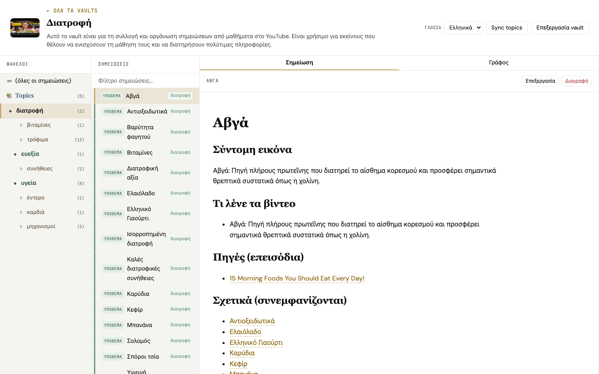
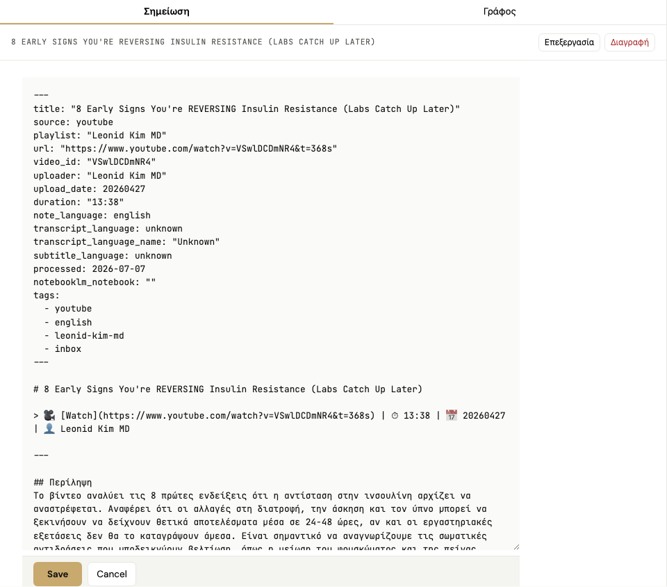
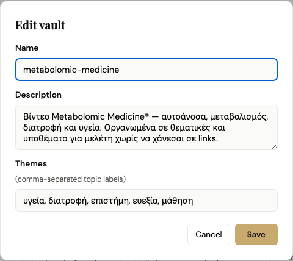
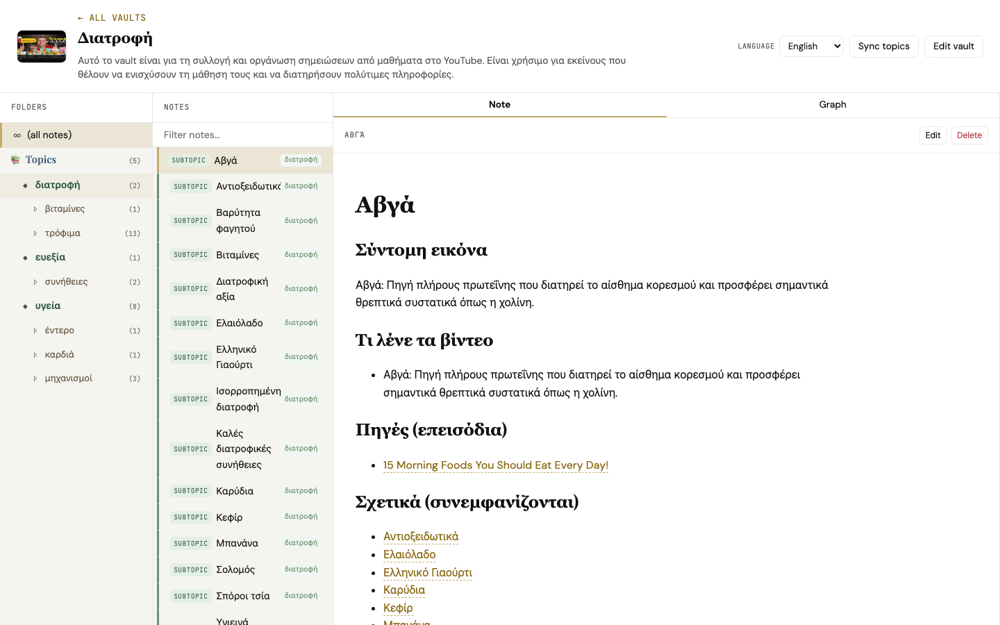

# Vault Dashboard — User Walkthrough

Step-by-step guide for using the **local Vault Dashboard** (`http://127.0.0.1:8787`) to browse playlist notes, ingest new videos, and explore topic graphs.

---

## Visual tour (screenshots)

| | |
|---|---|
| **Home** — ingest form + all vault cards |  |
| **Vault cards** — cover, themes, stats |  |
| **New vault form** — name & description before ingest |  |
| **Explorer** — folder tree + note list + reading a note |  |
| **Index note** — entry point for every vault |  |
| **Topic note** — theme MOC with linked episodes |  |
| **Video note** — summary + key frames from the video |  |
| **Graph (overview)** — themes, videos, links |  |
| **Graph (theme scope)** — zoom into one theme folder |  |
| **Graph (full)** — every note and wikilink |  |
| **Ολ Ιν vault** — 50+ episode business playlist |  |
| **Ολ Ιν graph** — large playlist link map |  |

---

## 1. Start the dashboard

From the project folder:

```bash
pip install -r requirements.txt
./run_dashboard.sh
```

Open **http://127.0.0.1:8787** in your browser.

To run in the background (macOS/Linux):

```bash
./run_dashboard_daemon.sh start
./run_dashboard_daemon.sh status
./run_dashboard_daemon.sh restart   # after code updates
```

Optional: set `DASHBOARD_PORT=8787` in `.env` to change the port.


---

## 2. What you see on the home page

| Area | Purpose |
|------|---------|
| **Add one YouTube video** | Paste a single video URL and add it to an existing vault or create a new one |
| **Your vaults** | Cards for every vault the dashboard finds on disk |
| **Language (Γλώσσα)** | Switch UI between Greek and English |

The dashboard discovers vaults from:

- `data/*/vault/` — output of the batch pipeline (`pipeline.py`)
- `Vaults/*/` — local Obsidian vault roots you keep in the repo
- `OBSIDIAN_VAULT_PATH` in `.env` — your main Obsidian vault (if configured)

Each card shows the vault name, description, note count, cover thumbnail, and theme chips.


---

## 3. Ingest a single YouTube video

1. Paste a YouTube URL (watch or youtu.be link).
2. Choose a **vault target**:
   - **Existing vault** — pick from the dropdown.
   - **New vault — I'll name it** — enter name and optional description.
   - **New vault — auto from first video** — name, description, and starter themes are suggested after enrichment.
3. Click **Ingest video**.


Requirements:

- `ffmpeg` on your PATH (for optional frame screenshots embedded in notes).
- `OPENAI_API_KEY` or `GEMINI_API_KEY` in `.env` for transcript enrichment.

Progress appears under the form. When finished, the new note appears in the vault and the card list refreshes.

---

## 4. Open a vault (Explorer)

Click a vault card (anywhere except **Edit** or **Delete**).

The **Explorer** has three columns:

| Column | What it does |
|--------|----------------|
| **Folders** | Tree of vault folders — click a folder to filter notes |
| **Notes** | Searchable list of Markdown notes in the current folder |
| **Note / Graph** | Read or edit the selected note, or view the link graph |


### Reading notes

- Click a note in the list to open it.
- **Wikilinks** `[[like this]]` are clickable — unresolved links are highlighted.
- Images in notes load from the vault assets folder (frames captured from the video).
- **Backlinks** appear at the bottom when other notes link here.

Start with **`00 - Index.md`** or **`00 - Topic Index.md`** when you open a vault for the first time.


### Editing notes

1. Open a note (not protected index files).
2. Click **Edit** → change Markdown in the editor → **Save**.
3. **Delete** removes the note (with confirmation).



### Vault metadata

- **Edit vault** (header or ✎ on home card) — change name, description, comma-separated themes.



- **Sync topics** — rebuild topic notes under `Topics/` from episode wikilinks (useful after bulk imports).

---

## 5. Graph view

Click the **Graph** tab in the right pane.

**Default mode is Auto** — the graph follows what you selected:

| You selected | Graph shows |
|--------------|-------------|
| **Index note** (`00 - Index`) | **Vault overview** — hierarchical tree: index → themes → videos (no subtopic hairball) |
| **A video or topic note** | **Focus view** — that note in the **center**, connected neighbours around it |
| **A folder** in Topics | Focus on the **theme** for that folder |


### Scope dropdown

| Scope | Best for |
|-------|----------|
| **Auto (current note)** | Recommended — overview for index, focus for everything else |
| **Vault overview** | Big picture: index + themes + videos in a **top-down tree** (labels hidden on video dots when crowded) |
| **Index map (themes only)** | Just index and theme nodes — lightest map |
| **Focus on selection** | Force ego graph around the open note |
| **Full vault (heavy)** | Every subtopic and link — use sparingly on large vaults |


### Layout tips

- **Overview / Index** use a **hierarchical layout** (index at top, themes middle, videos as small dots below) — not a tangled circle.
- **Focus** puts the **selected note in the center** (gold ring) and zooms in; hover any dot for its full title.
- Use **Fit** to re-center on the focused note.

- **＋ / －** — zoom in and out  
- **Fit** — fit the whole graph in view  
- **Unfreeze layout** — toggle physics so nodes settle or stay draggable  

**Click a node** to jump back to the **Note** tab and open that note.

Tip: select a folder under `Topics/YourTheme/` before switching to **Current theme** or **Current subtopic** scope.

### Large playlist example (Ολ Ιν)

A 50+ video Greek business podcast vault shows how the graph scales:


---

## 6. Language (Greek / English)

Use the **Γλώσσα / Language** dropdown in the header (home and explorer).

- UI labels, buttons, and section headers in notes switch between Greek and English.
- Episode body text stays in the language chosen at ingest time (`OUTPUT_LANGUAGE` in `.env`).



---

## 7. Batch pipeline vs dashboard

| Task | Tool |
|------|------|
| Whole playlist or channel (50+ videos) | `python pipeline.py` or `./run_pipeline.sh` |
| One video at a time, quick add | Dashboard ingest form |
| NotebookLM podcast / quiz / flashcards | `python pipeline.py --only notebooklm` |
| Browse, search, graph, light edits | Dashboard explorer |

After a batch run, vaults appear automatically on the dashboard home page under **Your vaults**.

---

## 8. Open the same notes in Obsidian

Notes live as plain Markdown on disk. You do not need the dashboard to use them in Obsidian.

1. In Obsidian: **File → Open folder as vault**.
2. Choose `data/<experiment-name>/vault/` (or your `Vaults/...` folder).
3. See **`docs/OBSIDIAN_USAGE.md`** for index pages, NotebookLM artifacts, and Obsidian’s own graph view.

The dashboard graph and Obsidian’s graph are different: the dashboard graph is scoped and colour-coded by note type (video, theme, subtopic); Obsidian shows all `[[wikilinks]]` in your vault.

---

## 9. Troubleshooting

| Problem | Fix |
|---------|-----|
| Graph tab does nothing | Hard refresh (`Cmd+Shift+R`) or `./run_dashboard_daemon.sh restart` |
| “Graph library failed to load” | Check internet (vis-network loads from CDN) and refresh |
| Empty graph for theme scope | Select a `Topics/...` folder first, then choose **Current theme** |
| Ingest fails | Check `.env` API key, `ffmpeg`, and the dashboard log (`.dashboard/dashboard.log`) |
| Vault missing on home | Confirm folder exists under `data/*/vault/` or `Vaults/` and restart dashboard |

---

## 10. Quick checklist for new users

1. [ ] Copy `.env.example` → `.env` and add API key + optional `PLAYLIST_URL`
2. [ ] Run `./run_dashboard.sh` and open http://127.0.0.1:8787
3. [ ] Ingest one test video with **New vault — auto**
4. [ ] Open the vault → read `00 - Index.md`
5. [ ] Open **Graph** tab → try **Overview** then **Current theme**
6. [ ] Optional: run full playlist with `./run_pipeline.sh`
7. [ ] Optional: open the same folder in Obsidian

For automated checks: `pytest tests/` (includes graph tab browser test when Playwright is installed).

To regenerate screenshots: `.venv/bin/python scripts/capture_dashboard_screenshots.py` (dashboard must be running).
